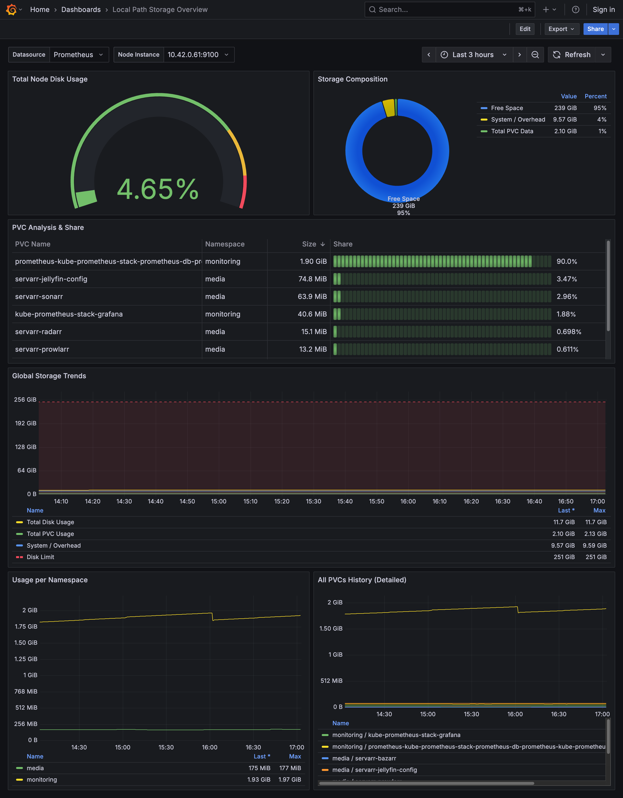

# Local Path Provisioner Exporter


[](https://artifacthub.io/packages/search?repo=local-path-exporter)


A specialized Prometheus Exporter for monitoring **local-path** PVC usage in Kubernetes.

## 🚀 The Problem

When using `rancher/local-path-provisioner` (or any directory-based storage like HostPath), standard Kubernetes metrics often fail to report the actual usage of specific Persistent Volumes.

## 💡 The Solution

This exporter runs as a **DaemonSet** on every node. It scans the directory structure used by the provisioner (e.g., `/var/lib/rancher/k3s/storage`), calculates the size of each directory (PVC) using a fast recursive traversal, and exposes metrics to Prometheus.

It automatically parses directory names to extract **Namespace** and **PVC Name** labels based on a configurable template.

## 📦 Installation via Helm

### 1. Add the Repository
```bash
helm repo add local-path-exporter https://tmusial99.github.io/local-path-exporter
helm repo update
```

### 2. Install the Chart
```bash
helm install local-path-exporter local-path-exporter/local-path-exporter \
  --namespace monitoring \
  --create-namespace
```

## 📊 Metrics

The exporter exposes the following metrics on port `9100`:

| Metric Name                           | Type  | Description                                                | Labels                      |
|---------------------------------------|-------|------------------------------------------------------------|-----------------------------|
| `local_path_pvc_usage_bytes`          | Gauge | Actual size of the PVC directory in bytes.                 | `pvc_namespace`, `pvc_name` |
| `local_path_storage_capacity_bytes`   | Gauge | Total capacity of the underlying filesystem.               | -                           |
| `local_path_storage_total_used_bytes` | Gauge | Total used space on the underlying filesystem (OS + PVCs). | -                           |

## 📈 Grafana Dashboard

A pre-built Grafana dashboard is included to visualize PVC usage and storage metrics in real-time. The dashboard provides an intuitive view of your local-path provisioner's storage consumption.



To import the dashboard into your Grafana instance, use the configuration file available at [`grafana/dashboard.json`](./grafana/dashboard.json).

## ⚙️ Configuration

You can customize the installation using `values.yaml`.

| Parameter                       | Description                                          | Default                            |
|---------------------------------|------------------------------------------------------|------------------------------------|
| `config.storagePath`            | Absolute path to the local-path storage on the node. | `/var/lib/rancher/k3s/storage`     |
| `config.refreshIntervalSeconds` | How often to recalculate directory sizes.            | `60`                               |
| `config.metricTemplate`         | Pattern to extract labels from directory names.      | `pvc-*_{pvc_namespace}_{pvc_name}` |
| `serviceMonitor.enabled`        | Enable ServiceMonitor for Prometheus Operator.       | `false`                            |

## 🛠️ Architecture

- **Language**: Go
- **Deployment**: DaemonSet (runs on every node)
- **Base Image**: Scratch (Static binary, ~5MB image size)
- **Privileges**: Requires `root` (`securityContext.runAsUser: 0`) to read other users' files on the host system.

## ⚡ Performance

This exporter is extremely lightweight and resource-efficient:
- **CPU Usage**: Negligible (minimal CPU consumption)
- **Memory Usage**: Approximately 10-20MB RAM per instance
- Designed for efficient directory scanning and periodic metric updates without impacting cluster performance

## 📜 License

MIT