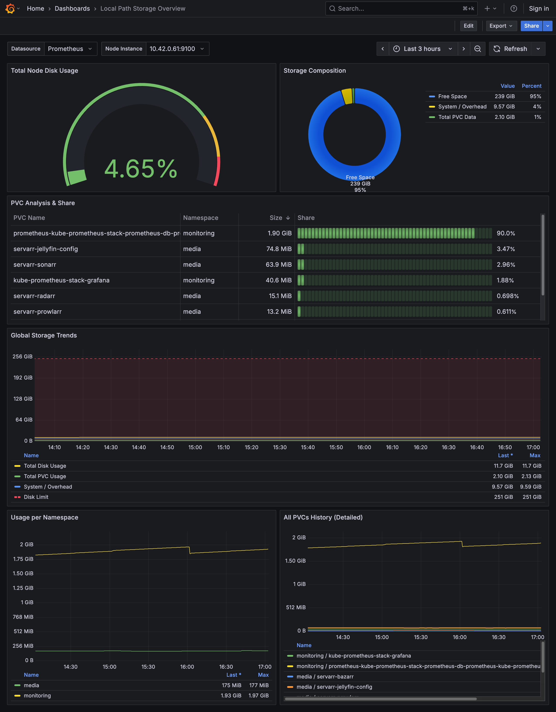

# local-path-exporter

[](https://artifacthub.io/packages/helm/local-path-exporter/local-path-exporter)


Prometheus exporter for disk usage of
[`rancher/local-path-provisioner`](https://github.com/rancher/local-path-provisioner)
PVCs and other directory-backed Kubernetes volumes.

Kubelet metrics often do not show per-PVC usage for host directories. This
exporter runs as a DaemonSet, scans the storage directory on each node, caches
the result, and exposes metrics on `:9100/metrics`.

## Install

```bash
helm repo add local-path-exporter https://tmusial99.github.io/local-path-exporter
helm repo update
helm install local-path-exporter local-path-exporter/local-path-exporter \
  --namespace monitoring --create-namespace
```

Enable Prometheus Operator discovery:

```bash
helm upgrade --install local-path-exporter local-path-exporter/local-path-exporter \
  --namespace monitoring --create-namespace \
  --set serviceMonitor.enabled=true
```

The default storage path is `/var/lib/rancher/k3s/storage`. It must exist on
each target node unless you change `config.hostPathType`.

## Metrics

| Metric | Description | Labels |
|---|---|---|
| `local_path_pvc_usage_bytes` | Real on-disk PVC directory usage, like `du`. | from `config.metricTemplate` |
| `local_path_storage_capacity_bytes` | Total capacity of the scanned filesystem. | none |
| `local_path_storage_total_used_bytes` | Total used space on the scanned filesystem. | none |

## Configuration

| Value | Default | Notes |
|---|---:|---|
| `config.storagePath` | `/var/lib/rancher/k3s/storage` | Host path to scan. |
| `config.metricTemplate` | `pvc-*_{pvc_namespace}_{pvc_name}` | Directory-name parser and metric label source. |
| `config.refreshIntervalSeconds` | `60` | Background scan interval. |
| `config.hostPathType` | `Directory` | Kubernetes `hostPath` type. |
| `serviceMonitor.enabled` | `false` | Creates a `ServiceMonitor`. |

The DaemonSet mounts the host path read-only and runs as UID/GID `0` so it can
stat files owned by other users. The container drops Linux capabilities, uses a
read-only root filesystem, and does not mount a service account token.

## Chart Verification

Chart packages are signed. To verify a downloaded chart:

```bash
curl -fsSL https://tmusial99.github.io/local-path-exporter/helm-signing-key.asc | gpg --import
gpg --export > ~/.gnupg/pubring.gpg
helm pull local-path-exporter/local-path-exporter --verify --keyring ~/.gnupg/pubring.gpg
```

Signing key fingerprint:
`7FED455C2F76B3E0216E73F26F0F38A50C4D9D03`.

## Dashboard

Grafana dashboard: [`grafana/dashboard.json`](./grafana/dashboard.json)



## License

MIT
